# `week6-team5-sql`

> SQL 처리 과정을 가장 작은 범위로 압축해, 내부 흐름이 보이도록 만든 교육용 SQL 처리기

## 한눈에 보기

| 항목      | 내용                                         |
| --------- | -------------------------------------------- |
| 목표      | SQL 실행 흐름을 초심자도 따라갈 수 있게 구현 |
| 입력      | `.sql` 파일                                  |
| 출력      | 표준 출력 + `.csv` 파일                      |
| 지원 문장 | `INSERT`, `SELECT`                           |
| 저장 방식 | `CSV`                                        |
| 스키마    | `<table>.schema`                             |

## 시스템 구조

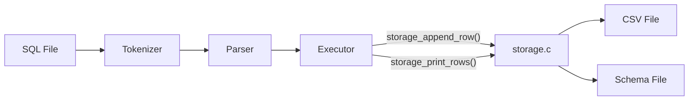

## 실행 흐름

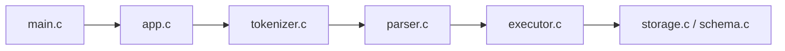

| 단계 | 함수 / 파일 | 핵심 역할 |
| --- | --- | --- |
| 1 | `main.c` | 프로그램 진입점 |
| 2 | `app.c` | SQL 파일 읽기, 전체 실행 제어 |
| 3 | `tokenizer.c` | SQL 문자열을 토큰 배열로 분리 |
| 4 | `parser.c` | 토큰 배열을 `SqlProgram`으로 변환 |
| 5 | `executor.c` + `storage.c` + `schema.c` | 스키마 확인 후 출력/CSV 반영 |

### 단계별 예시 이미지

### 1. `tokenizer.c`

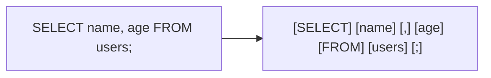

### 2. `parser.c` - SELECT

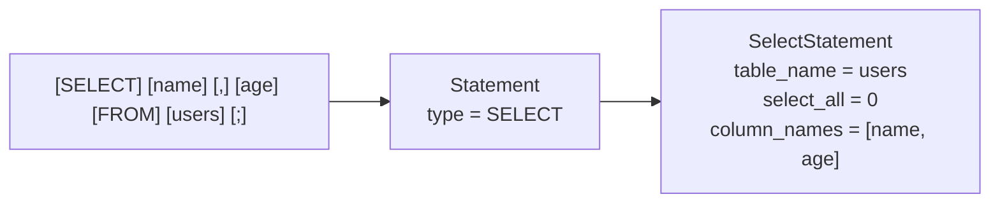

### 3. `executor.c` + `storage.c` - SELECT

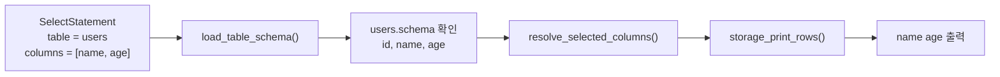

### 4. `parser.c` - INSERT

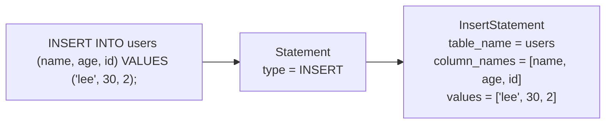

### 5. `executor.c` + `storage.c` - INSERT

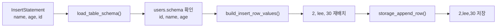

## 핵심 구조체

| 구조체 | 역할 | 생성 단계 | 포함 |
| --- | --- | --- | --- |
| `TokenList` | SQL 문자열을 잘라낸 토큰 배열 | `tokenizer.c` | `Token[]` |
| `SqlProgram` | 파싱된 SQL 문장 목록 | `parser.c` | `Statement[]` |
| `Statement` | `INSERT` / `SELECT` 구분 단위 | `parser.c` | `InsertStatement` or `SelectStatement` |
| `InsertStatement` | 테이블명, 컬럼명[], 값[] | `parser.c` | `LiteralValue[]` |
| `SelectStatement` | 테이블명, `select_all`, 컬럼명[] | `parser.c` | — |
| `TableSchema` | 컬럼 순서·타입 정의 | `schema.c` | `ColumnSchema[]` |
| `ErrorInfo` | 오류 메시지 + 위치 | 전 단계 공용 | — |

### 구조체를 사용하는 이유

- tokenizer 결과와 parser 결과를 단계별로 분리해서 저장하기 위해 사용했습니다.
- `INSERT`, `SELECT`를 문자열이 아니라 정리된 데이터 형태로 넘기기 위해 사용했습니다.
- executor가 스키마 기준으로 컬럼 순서와 타입을 확인하기 쉽게 만들기 위해 사용했습니다.
- 오류가 어느 단계에서 났는지 같은 형식으로 기록하기 위해 사용했습니다.

### 구조체를 사용했을 때 장점

- 각 단계가 어떤 데이터를 받고 어떤 데이터를 만드는지 바로 보입니다.
- tokenizer, parser, executor 역할이 섞이지 않습니다.
- `INSERT`, `SELECT` 문장을 같은 `Statement` 단위로 관리할 수 있습니다.
- 디버깅할 때 문자열 전체를 다시 읽지 않고, 정리된 결과만 보면 됩니다.
- 발표에서도 "문자열 -> 토큰 -> 문장 구조체 -> 실행" 흐름을 설명하기 쉽습니다.

## 지원 SQL

```sql
INSERT INTO users VALUES (1, 'kim', 20);
INSERT INTO users (name, id, age) VALUES ('lee', 2, 30);
SELECT * FROM users;
SELECT name, age FROM users;
```

## 시연 예시


```sql
INSERT INTO users VALUES (1, 'kim', 20);
INSERT INTO users (name, age, id) VALUES ('lee', 30, 2);
INSERT INTO users VALUES (3, 'park', 27);
INSERT INTO users (age, id, name) VALUES (41, 4, 'choi');
INSERT INTO users VALUES (5, 'jung', 33);
SELECT * FROM users;
SELECT name, age FROM users;
SELECT age, id FROM users;
```

## 우리 팀의 포인트

### 1. tokenizer, parser, executor의 오류를 나눠서 처리

| 단계      | 대표 메시지                            |
| --------- | -------------------------------------- |
| Tokenizer | `지원하지 않는 문자를 찾았습니다.`     |
| Tokenizer | `문자열 리터럴이 닫히지 않았습니다.`   |
| Parser    | `FROM 키워드가 필요합니다.`            |
| Parser    | `문장 끝에는 세미콜론이 필요합니다.`   |
| Parser    | `컬럼 수와 값 수가 일치하지 않습니다.` |
| Executor  | `INSERT 값 타입이 스키마와 맞지 않습니다.` |
| Executor  | `SELECT 대상 컬럼이 스키마에 없습니다.` |

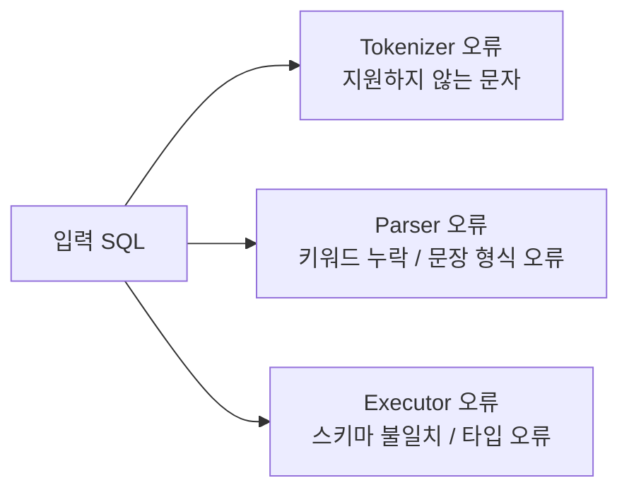

예시:

- tokenizer 오류: `SELECT @ FROM users;`
- parser 오류: `SELECT name users;`
- executor 오류: `INSERT INTO users VALUES ('kim', 1, 20);`

### 2. storage.c에서도 파일/CSV 오류를 따로 처리

| 구분 | 대표 메시지 |
| --- | --- |
| Storage | `데이터 파일을 만들 수 없습니다.` |
| Storage | `기존 데이터 파일 헤더 형식이 잘못되었습니다.` |
| Storage | `CSV 헤더가 스키마와 다릅니다.` |
| Storage | `CSV 행을 읽는 중 오류가 발생했습니다.` |

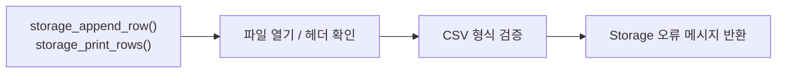

예시:

- storage 오류: `데이터 파일을 만들 수 없습니다.`
- storage 오류: `CSV 헤더가 스키마와 다릅니다.`

### 3. 오류 위치까지 함께 출력

```text
오류: 지원하지 않는 문자를 찾았습니다. (line 1, column 8)
오류: FROM 키워드가 필요합니다. (line 1, column 13)
```

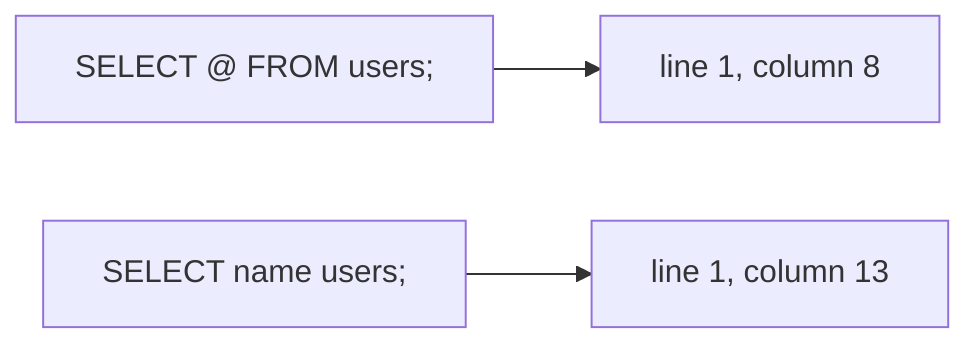

### 4. 스키마를 기준으로 컬럼 순서와 타입을 맞춤

```text
id:int,name:string,age:int
```

- 컬럼 순서를 통일합니다.
- `int`, `string` 타입을 검증합니다.
- 사용자가 컬럼 순서를 바꿔도 schema 기준으로 다시 맞춥니다.

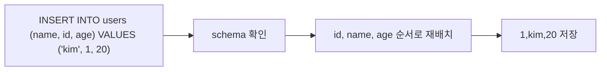

### 5. executor와 storage를 분리해 역할을 명확히 구분

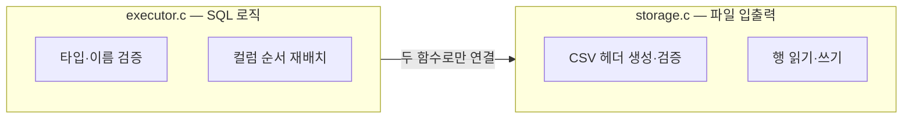

- `storage_append_row()` — INSERT 시 CSV에 한 행 추가
- `storage_print_rows()` — SELECT 시 해당 컬럼만 출력
- storage.c를 교체해도 executor.c를 건드릴 필요가 없음

## 협업과 회고

| 주제      | 내용                                                                  |
| --------- | --------------------------------------------------------------------- |
| 리뷰 방식 | `AGENTS.md`의 멀티 페르소나 관점을 참고해 에이전트를 리뷰어처럼 활용  |
| 협업 방식 | 한 컴퓨터에서 상세 프롬프트를 작성하고 같은 환경에서 바로 빌드·테스트 |
| 효과      | 정확성, 자료구조 일관성, 초심자 가독성을 분리해 점검 가능             |

### 작업 플로우

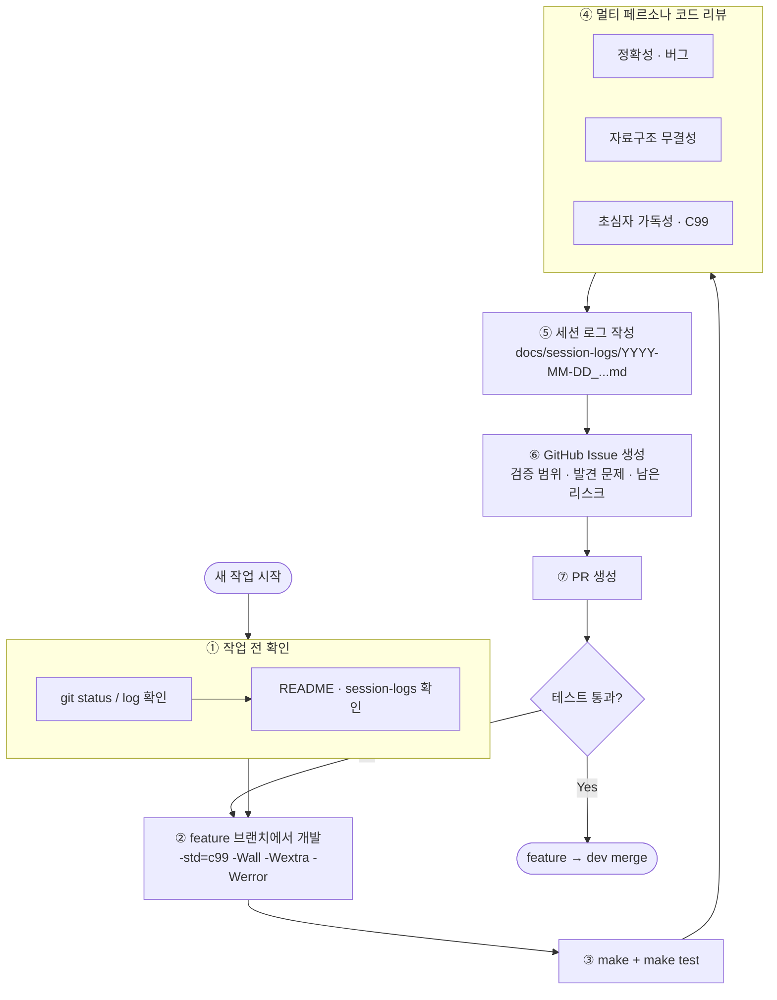
