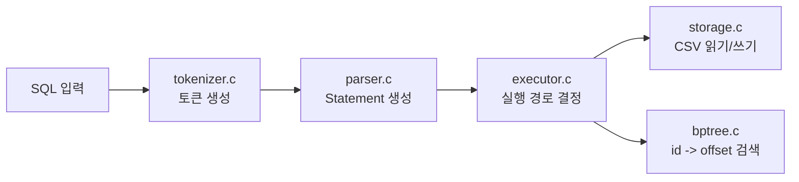
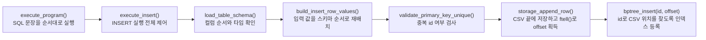
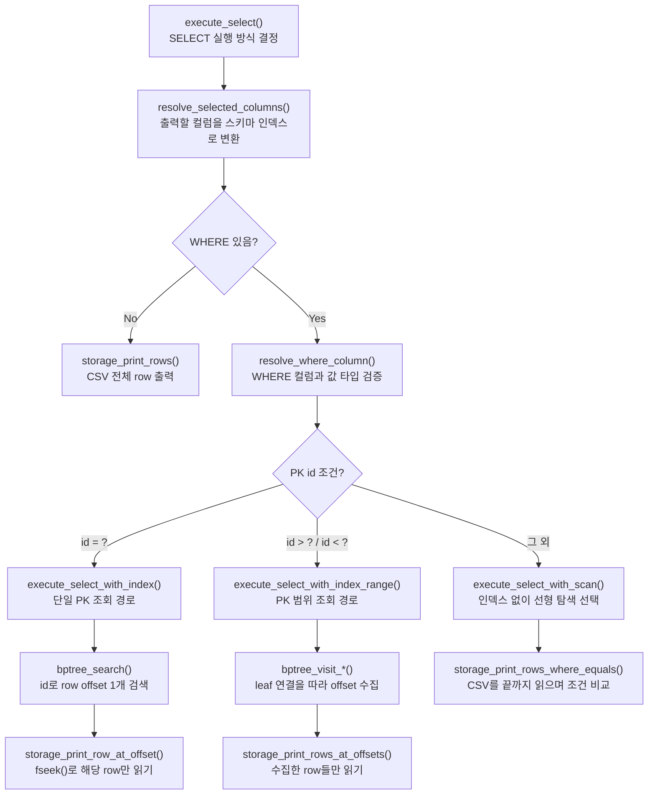

# 7주차 B+ Tree 인덱스 발표 자료

## 목표

본 프로젝트는 기존 CSV 기반 SQL 처리기에 메모리 기반 B+ Tree 인덱스를 연동한 구현입니다.  
목표는 `WHERE id = ?`처럼 PK를 기준으로 한 조회에서 선형 탐색 대신 B+ Tree 인덱스를 사용하도록 만드는 것입니다.  
스키마에 `id:int` 컬럼이 있으면 이를 PK로 간주하고, B+ Tree에는 row 전체가 아니라 `id -> CSV row offset`만 저장합니다.

```text
key   = id
value = CSV 파일에서 해당 row가 시작되는 위치
```

즉 CSV는 실제 데이터를 보관하고, B+ Tree는 그 데이터로 빠르게 찾아가기 위한 주소록 역할을 합니다.

---

## 1. 요구사항 대응 요약

| 요구사항 | 구현 내용 |
| --- | --- |
| 자동 ID 부여 | `id`가 빠진 INSERT는 현재 최대 id 다음 값을 자동으로 채웁니다. |
| B+ Tree 인덱스 등록 | CSV 저장 후 `id -> row offset`을 B+ Tree에 등록합니다. |
| ID 기준 SELECT | `WHERE id = ?`는 `[INDEX]` 경로로 처리합니다. |
| 다른 필드 SELECT | `WHERE name`, `WHERE age`, `id != ?`는 `[SCAN]` 경로로 처리합니다. |
| 대용량 테스트 | `make seed-demo-data RECORDS=1000000`로 100만 건 CSV를 생성합니다. |

---

## 2. 전체 구조

기존 SQL 처리기의 흐름은 유지하고, 실행 단계에서만 B+ Tree와 CSV 스토리지를 함께 사용합니다.  
즉 파서까지는 SQL을 구조체로 바꾸는 역할이고, `executor.c`에서 인덱스를 사용할지 선형 탐색을 할지 결정합니다.



---

## 3. INSERT 실행 시 B+ Tree 적재 흐름

INSERT는 파서가 만든 `InsertStatement`를 `execute_insert()`가 받아 처리합니다.  
사용자가 컬럼 순서를 바꿔 입력해도 `build_insert_row_values()`에서 스키마 순서로 다시 맞추고, `id`가 빠져 있으면 자동 PK를 채웁니다.  
CSV에 쓰기 직전 `storage_append_row()`가 `ftell()`로 row offset을 구하고, 저장이 끝나면 `bptree_insert(id, offset)`으로 인덱스를 갱신합니다.



```text
CSV 저장 순서 = INSERT 순서
B+ Tree 정렬 순서 = id 순서
```

---

## 4. SELECT 실행 시 Index / Scan 분기

SELECT는 `execute_select()`에서 먼저 스키마와 출력 컬럼을 확인합니다.  
이후 WHERE 조건이 PK인 `id`를 대상으로 하는지 보고 실행 방식이 갈라집니다.  
`WHERE id = ?`는 B+ Tree에서 offset 하나를 찾고, `WHERE id > ?`, `WHERE id < ?`는 leaf 연결을 따라 range scan을 합니다.  
반면 `name`, `age` 같은 일반 컬럼 조건이나 `id != ?`는 인덱스를 쓰지 않고 CSV를 처음부터 끝까지 읽습니다.



---

## 5. Full Scan과 Index 방식 차이

`id` 조건은 B+ Tree가 CSV 위치를 바로 알려주기 때문에 필요한 row만 `fseek()`로 읽습니다.  
반대로 `age`, `name` 조건은 인덱스가 없으므로 CSV 첫 row부터 마지막 row까지 파싱하고 비교합니다.

```text
[INDEX]       WHERE id = 900000
[INDEX-RANGE] WHERE id > 999990
[SCAN]        WHERE name = 'user900000'
elapsed: ... ms
```

결과가 적은 PK 조회에서는 인덱스 효과가 크고, 결과가 거의 전체 row인 조건은 출력 비용이 커서 차이가 줄어듭니다. 이 차이를 선택도(selectivity)라고 설명할 수 있습니다.

---

## 6. B+ Tree 핵심 구현

B+ Tree는 `bptree.c`에 독립 모듈로 구현했습니다.  
key는 `id`, value는 CSV row offset이며, 중복 key는 허용하지 않습니다.

```text
bptree_insert()  : key를 정렬된 leaf node에 삽입
bptree_search()  : id로 offset 1개 검색
leaf split       : leaf가 가득 차면 오른쪽 leaf를 만들고 key를 나눔
internal split   : 부모 node도 가득 차면 split 후 promoted key를 위로 올림
leaf next        : id > ?, id < ? 범위 조회에서 순차 이동에 사용
```

이 구현 덕분에 `WHERE id = ?`는 tree 높이만큼만 이동해 offset을 찾고, `WHERE id > ?`, `WHERE id < ?`는 leaf 연결을 따라 필요한 offset들을 모을 수 있습니다.

---

## 7. 메모리 인덱스 재구성

이번 인덱스는 디스크에 저장하지 않는 메모리 기반 구조입니다.  
따라서 프로그램을 새로 실행하면 B+ Tree는 비어 있고, 기존 CSV 데이터와 다시 연결하는 과정이 필요합니다.

테이블을 처음 접근할 때 `get_table_state_index()`가 런타임 상태를 확인합니다.  
상태가 없으면 `create_table_state()`가 B+ Tree를 만들고, `storage_rebuild_pk_index()`가 CSV를 한 번 읽어 기존 row의 `id -> offset`을 다시 등록합니다.

```text
테이블 처음 접근
-> get_table_state_index()
-> create_table_state()
-> storage_rebuild_pk_index()
-> CSV의 기존 id와 offset을 B+ Tree에 재등록
```

이후 같은 실행 안에서는 이미 만들어진 B+ Tree를 재사용하므로, 두 번째 PK 조회부터는 재구성 비용 없이 바로 검색합니다.

---

## 검증과 마무리

- B+ Tree 삽입 / 검색 / split 테스트
- 자동 PK 증가와 중복 PK 방지 테스트
- `WHERE id` 인덱스 조회, `WHERE name`, `WHERE age` full scan 테스트
- 1,000,000건 CSV 생성 후 성능 비교

```bash
make test
make seed-demo-data RECORDS=1000000
./build/sqlproc --schema-dir ./examples/schemas --data-dir ./demo-data ./examples/perf_compare.sql
```

정리하면, 이번 구현은 기존 SQL 처리기 구조를 유지하면서 `executor.c`에서 조회 방식을 분기하도록 연결한 것이 핵심입니다.  
PK 조회는 B+ Tree로 빠르게 offset을 찾고, 그 외 조건은 CSV 선형 탐색으로 처리해 두 방식의 차이를 로그와 실행 시간으로 확인할 수 있습니다.
