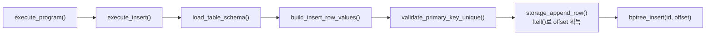
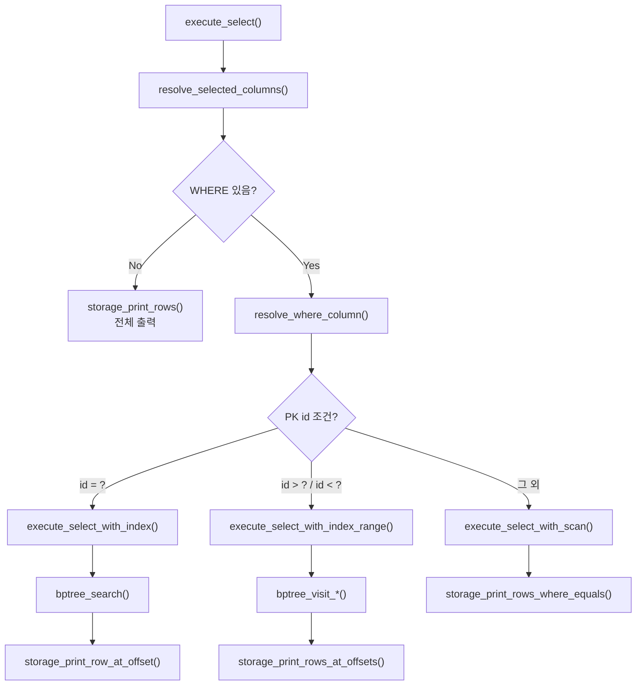

# 7주차 B+ Tree 인덱스 발표 자료

## 목표

이번 구현의 핵심은 기존 CSV 기반 SQL 처리기에 메모리 기반 B+ Tree 인덱스를 붙인 것입니다.  
스키마에 `id:int` 컬럼이 있으면 이를 PK로 보고, B+ Tree에는 row 전체가 아니라 `id -> CSV row offset`만 저장합니다.

```text
key   = id
value = CSV 파일에서 해당 row가 시작되는 위치
```

즉 CSV는 실제 데이터를 보관하고, B+ Tree는 그 데이터로 빠르게 찾아가기 위한 주소록 역할을 합니다.

---

## 1. INSERT 실행 시 B+ Tree 적재 흐름

INSERT는 파서가 만든 `InsertStatement`를 `execute_insert()`가 받아 처리합니다.  
사용자가 컬럼 순서를 바꿔 입력해도 `build_insert_row_values()`에서 스키마 순서로 다시 맞추고, `id`가 빠져 있으면 자동 PK를 채웁니다.  
CSV에 쓰기 직전 `storage_append_row()`가 `ftell()`로 row offset을 구하고, 저장이 끝나면 `bptree_insert(id, offset)`으로 인덱스를 갱신합니다.



```text
CSV 저장 순서 = INSERT 순서
B+ Tree 정렬 순서 = id 순서
```

---

## 2. SELECT 실행 시 Index / Scan 분기

SELECT는 `execute_select()`에서 먼저 스키마와 출력 컬럼을 확인합니다.  
이후 WHERE 조건이 PK인 `id`를 대상으로 하는지 보고 실행 방식이 갈라집니다.  
`WHERE id = ?`는 B+ Tree에서 offset 하나를 찾고, `WHERE id > ?`, `WHERE id < ?`는 leaf 연결을 따라 range scan을 합니다.  
반면 `name`, `age` 같은 일반 컬럼 조건이나 `id != ?`는 인덱스를 쓰지 않고 CSV를 처음부터 끝까지 읽습니다.



---

## 3. Full Scan과 Index 방식 차이

`id` 조건은 B+ Tree가 CSV 위치를 바로 알려주기 때문에 필요한 row만 `fseek()`로 읽습니다.  
반대로 `age`, `name` 조건은 인덱스가 없으므로 CSV 첫 row부터 마지막 row까지 파싱하고 비교합니다.

```text
[INDEX]       WHERE id = 900000
[INDEX-RANGE] WHERE id > 999990
[SCAN]        WHERE name = 'user900000'
elapsed: ... ms
```

결과가 적은 PK 조회에서는 인덱스 효과가 크고, 결과가 거의 전체 row인 조건은 출력 비용이 커서 차이가 줄어듭니다. 이 차이를 선택도(selectivity)라고 설명할 수 있습니다.

---

## 검증

- B+ Tree 삽입 / 검색 / split 테스트
- 자동 PK 증가와 중복 PK 방지 테스트
- `WHERE id` 인덱스 조회, `WHERE name`, `WHERE age` full scan 테스트
- 1,000,000건 CSV 생성 후 성능 비교

```bash
make test
make seed-demo-data RECORDS=1000000
./build/sqlproc --schema-dir ./examples/schemas --data-dir ./demo-data ./examples/perf_compare.sql
```
