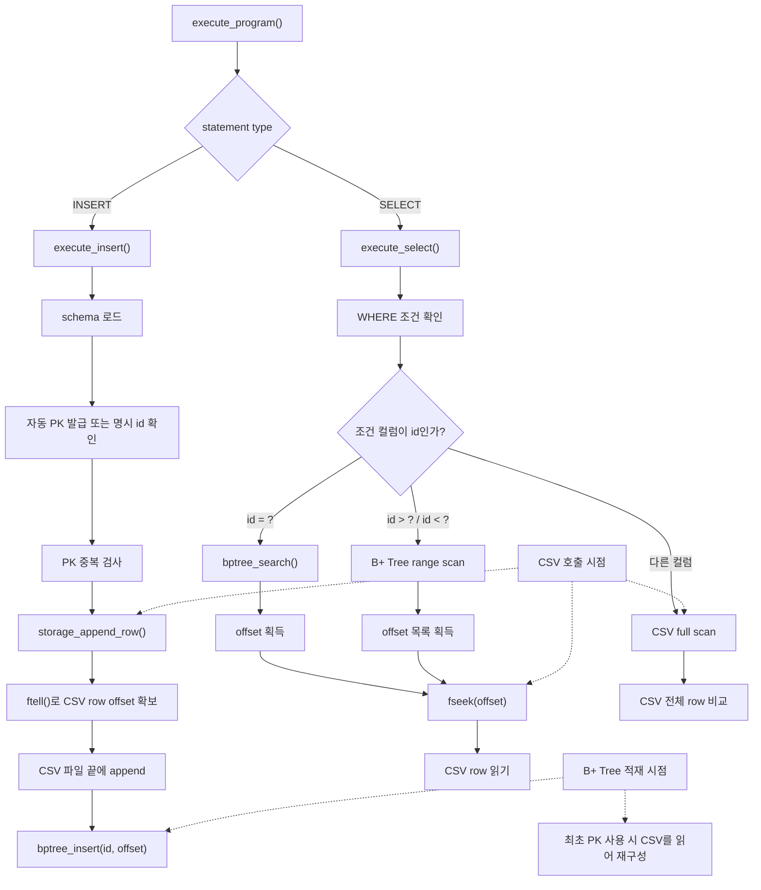
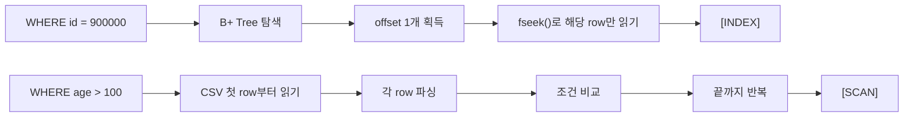

# 7주차 B+ Tree 인덱스 발표 자료

## 목표

기존 CSV 기반 SQL 처리기에 메모리 기반 B+ Tree 인덱스를 붙였습니다.  
핵심은 `id`를 PK로 보고, `id -> CSV row offset`을 B+ Tree에 저장하는 것입니다.

즉 B+ Tree에는 row 전체가 아니라 CSV에서 해당 row가 시작되는 위치만 저장합니다.

```text
key   = id
value = CSV row offset
```

---

## 1. INSERT / SELECT 이후 B+ Tree와 CSV 흐름



메모리 인덱스라서 프로그램을 새로 켜면 B+ Tree는 비어 있습니다.  
처음 `WHERE id`를 쓰거나 INSERT에서 PK 상태가 필요할 때 CSV를 한 번 읽어 `id -> offset`을 재구성합니다.

---

## 2. Full Scan과 Index 방식 차이



`id` 조건은 B+ Tree가 CSV 위치를 바로 알려줍니다.  
반면 `age`, `name` 같은 컬럼은 인덱스가 없어서 CSV 전체를 읽고 비교합니다.

---

## 데모 포인트

```sql
SELECT * FROM users WHERE id = 900000;
SELECT * FROM users WHERE name = 'user900000';
SELECT * FROM users WHERE id > 999990;
SELECT * FROM users WHERE age > 100;
```

출력 로그로 조회 방식을 바로 볼 수 있습니다.

```text
[INDEX]
[INDEX-RANGE]
[SCAN]
elapsed: ... ms
```

결과가 적은 `id = ?`, `id > ?` 조건에서는 인덱스 효과가 큽니다.  
반대로 결과가 거의 전체 row인 조건은 출력 비용이 커서 인덱스 효과가 줄어듭니다.  
이 차이를 선택도(selectivity)라고 설명할 수 있습니다.

---

## 검증

- B+ Tree 삽입 / 검색 / split 테스트
- 중복 PK 방지 테스트
- 자동 PK 증가 테스트
- `WHERE id` 인덱스 조회 테스트
- `WHERE age`, `WHERE name` full scan 테스트
- 1,000,000건 CSV 생성 후 성능 비교

```bash
make test
make seed-demo-data RECORDS=1000000
./build/sqlproc --schema-dir ./examples/schemas --data-dir ./demo-data ./examples/perf_compare.sql
```
