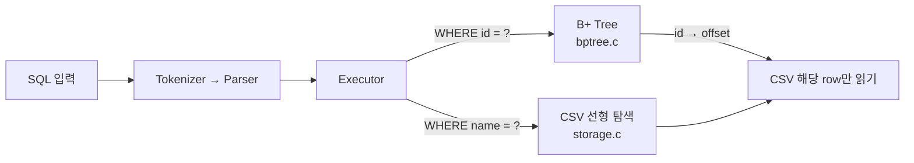
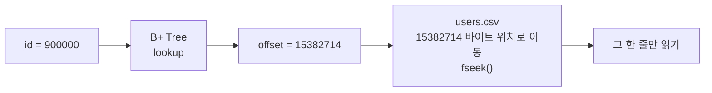
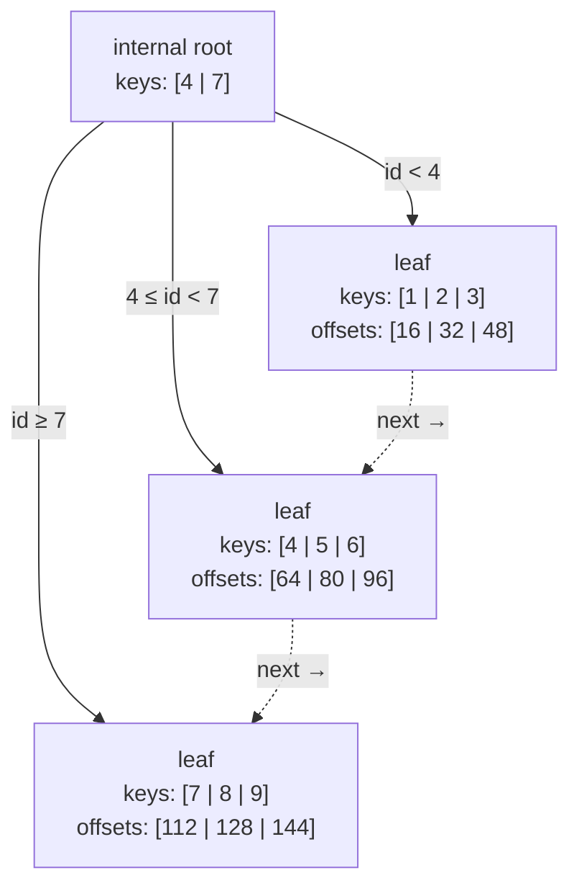
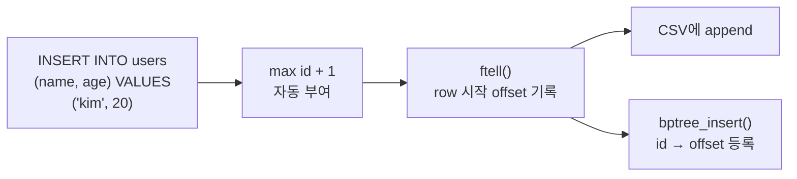
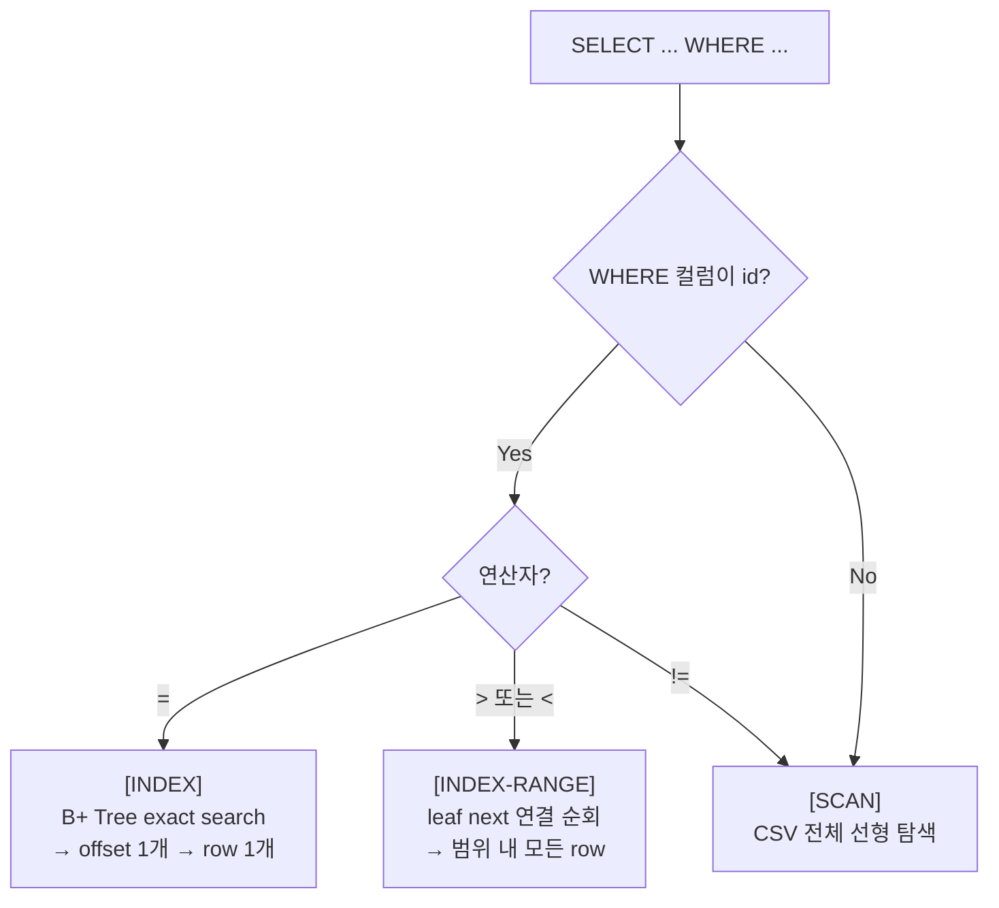
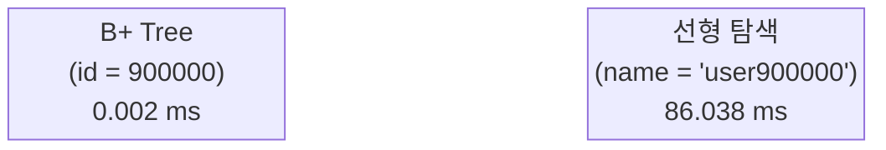

# B+ Tree 인덱스 구현

> `WHERE id = ?` 조회가 왜 빠른지 — 직접 만들어서 측정했습니다.

---

## 이번 주 핵심 질문

> **100만 건의 레코드에서 특정 id를 어떻게 빠르게 찾을 수 있을까?**

CSV 파일에서 `id = 900000`을 찾으려면 원래는 처음부터 끝까지 읽어야 합니다.  
이번 주는 그 문제를 **B+ Tree 인덱스**로 해결했습니다.

---

## 전체 구조



이전 주차에서 만든 SQL 처리기(`tokenizer → parser → executor`)를 그대로 사용하고,  
**executor 단에서 PK 조건인지 아닌지를 판단해 경로를 나눕니다.**

---

## B+ Tree는 무엇을 저장하나

> **데이터를 저장하지 않습니다. 위치(offset)만 저장합니다.**



| B+ Tree에 저장되는 것 | 의미 |
|---|---|
| **key** | PK `id` 값 |
| **value** | CSV 파일에서 해당 row가 시작되는 byte offset |

실제 row 데이터(`1,kim,20`)는 CSV에만 있습니다.  
B+ Tree는 "책 내용"이 아니라 **"책갈피"** 입니다.

---

## B+ Tree 구조

이 구현은 **Order 4** — leaf 하나에 key 최대 3개, 자식 최대 4개.



- **internal node**: 어느 자식으로 내려갈지 안내하는 경계값만 저장
- **leaf node**: 실제 `id → offset` 쌍 저장
- **leaf의 `next` 포인터**: 범위 조회(`id > ?`, `id < ?`)를 위해 leaf를 연결 리스트로 연결

---

## INSERT가 인덱스를 유지하는 방법



- `id`를 생략하면 현재 최대 PK + 1을 자동으로 계산합니다.
- CSV에 row를 쓰기 **직전** `ftell()`로 위치를 확보한 뒤 B+ Tree에 등록합니다.
- **프로그램 재시작** 시: CSV를 처음부터 스캔해 메모리 B+ Tree를 자동 재구성합니다.

---

## 조회 분기



| 쿼리 | 실행 로그 | 경로 |
|---|---|---|
| `WHERE id = 900000` | `[INDEX]` | B+ Tree → offset 1개 → row 1개 |
| `WHERE id > 999990` | `[INDEX-RANGE]` | leaf 연결 리스트 순회 |
| `WHERE name = 'user900000'` | `[SCAN]` | CSV 처음부터 끝까지 |
| `WHERE age != 20` | `[SCAN]` | CSV 처음부터 끝까지 |

---

## 성능 비교

> **100만 건 기준 측정 (`./build/bench_index 1000000`)**

| 조회 방식 | 쿼리 | 소요 시간 |
|---|---|---|
| **B+ Tree 인덱스** | `WHERE id = 900000` | **0.002 ms** |
| **CSV 선형 탐색** | `WHERE name = 'user900000'` | **86.038 ms** |



약 **43,000배** 차이.  
같은 row를 찾는 쿼리인데, 어떤 경로를 타느냐에 따라 결과가 달라집니다.

---

## 우리 팀의 추가 구현

| 항목 | 내용 |
|---|---|
| **범위 조회** | `WHERE id > ?`, `WHERE id < ?` — leaf `next` 포인터를 따라 처리 |
| **인덱스 자동 재구성** | 재시작 후 첫 접근 시 CSV 스캔으로 B+ Tree rebuild |
| **독립 벤치마크** | `bench_index` — parser/executor 없이 인덱스 성능만 순수 측정 |
| **레이어별 오류 분리** | Tokenizer / Parser / Executor / Storage 단계별 오류 메시지 |

---

## 데모

```bash
# 빌드
make

# INSERT + SELECT 흐름 확인 ([INDEX] / [SCAN] 로그 출력)
rm -rf demo-data && mkdir demo-data
./build/sqlproc --schema-dir ./examples/schemas \
                --data-dir ./demo-data \
                ./examples/index_demo.sql

# elapsed 비교 (PK vs 비-PK)
./build/sqlproc --schema-dir ./examples/schemas \
                --data-dir ./demo-data \
                ./examples/perf_compare.sql

# 순수 벤치마크 (100만 건)
./build/bench_index 1000000
```
