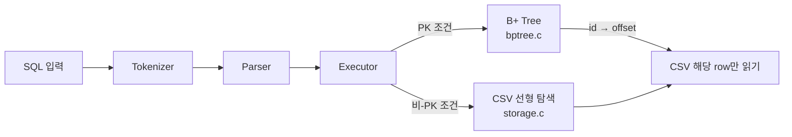
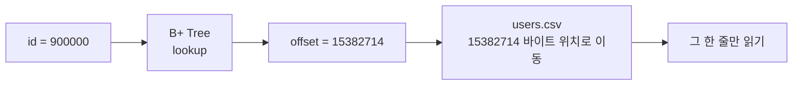
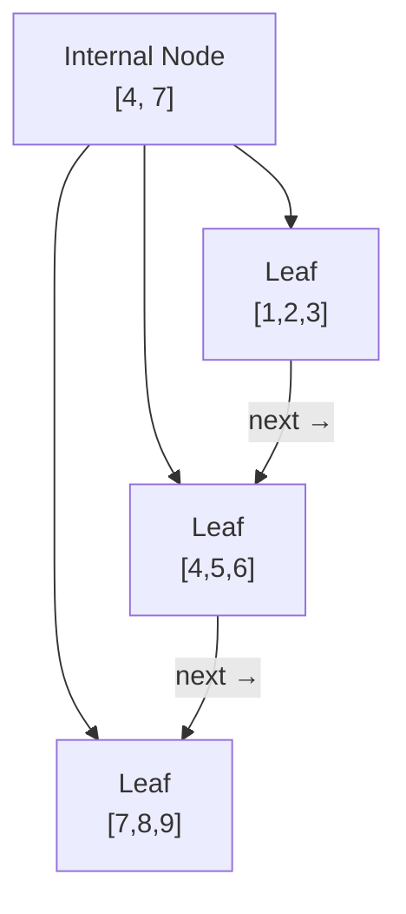
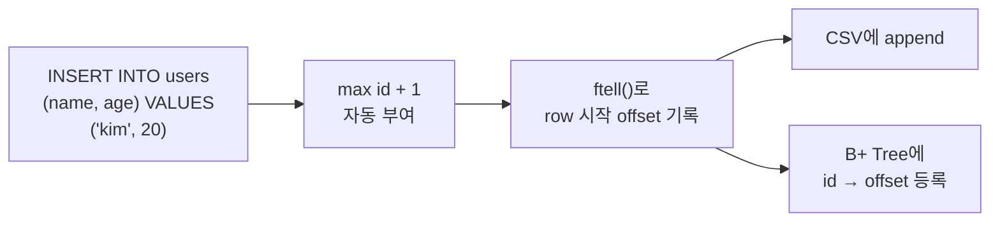
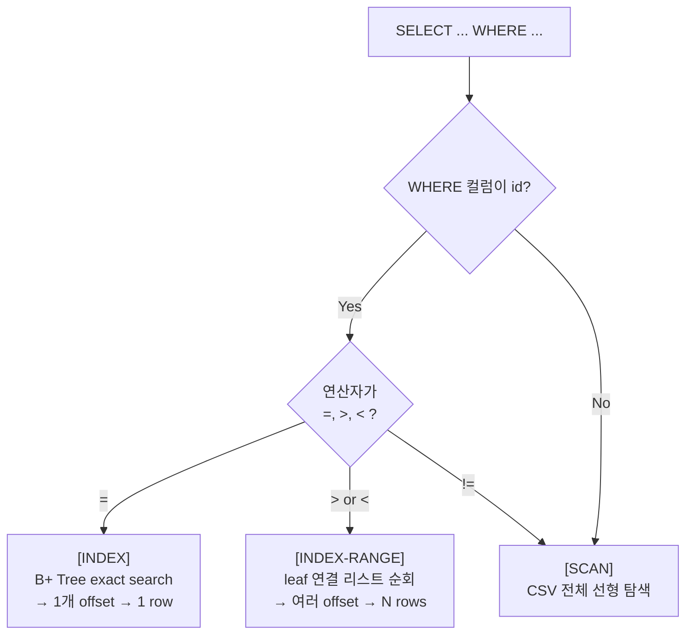
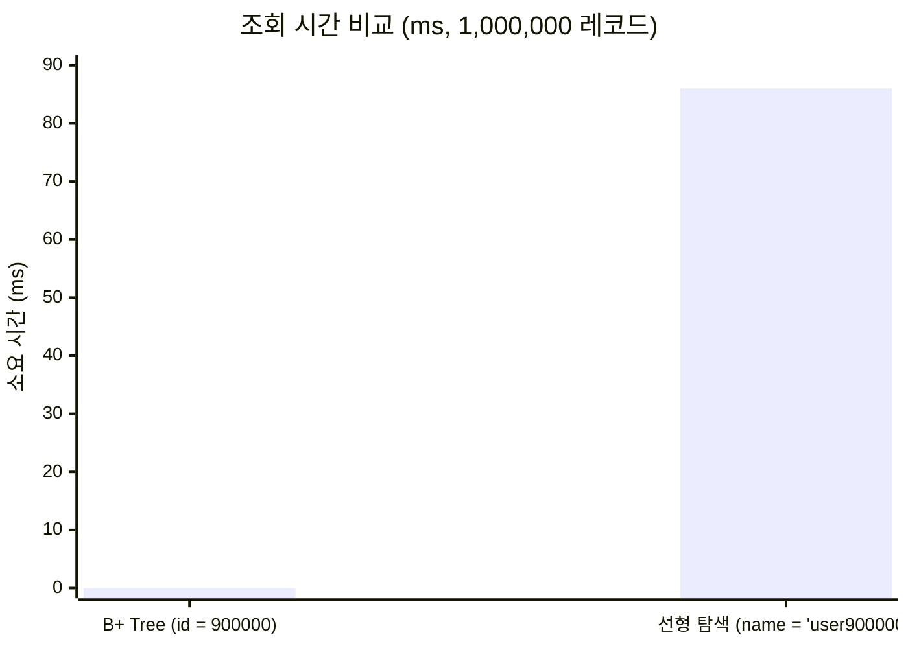

# 7주차 발표: B+ Tree 인덱스 구현

> 발표 시간: 4분 내외 | 발표자 참고용

---

## 슬라이드 1 — 이번 주 과제 한 줄 요약 (30초)

> "WHERE id = ? 가 왜 빠른지, B+ Tree로 직접 보여줍니다."

- 이전에 만든 C언어 SQL 처리기에 **B+ Tree 인덱스**를 붙였습니다.
- PK(`id`) 조회: B+ Tree → CSV 한 줄만 읽기
- 비-PK 조회: CSV 전체 선형 탐색
- 100만 건 데이터로 속도 차이를 직접 측정했습니다.

---

## 슬라이드 2 — 전체 구조 (30초)



핵심은 **Executor 단에서 분기**가 일어난다는 점입니다.  
`WHERE` 컬럼이 `id`이고 연산자가 `=`, `>`, `<`이면 B+ Tree,  
그 외에는 기존 선형 탐색을 그대로 사용합니다.

---

## 슬라이드 3 — B+ Tree가 저장하는 것 (45초)

B+ Tree는 **데이터를 저장하지 않습니다.** 책갈피만 저장합니다.



| B+ Tree key | B+ Tree value |
|---|---|
| PK `id` 값 | CSV 파일의 row 시작 `offset` |

- 실제 row는 CSV에만 있고, B+ Tree는 **위치 정보(offset)만** 들고 있습니다.
- `ftell()`로 쓰기 직전 offset을 기록, `fseek()`으로 그 위치로 바로 이동합니다.

---

## 슬라이드 4 — B+ Tree 구조 (45초)

이 구현은 **Order 4** B+ Tree입니다.



- **Internal node**: 탐색 방향을 가리키는 key만 저장
- **Leaf node**: 실제 `id → offset` 페어 저장 + 연결 리스트로 연결
- **Leaf 연결 리스트** 덕분에 범위 조회(`id > ?`, `id < ?`)도 효율적으로 처리

---

## 슬라이드 5 — INSERT가 인덱스를 유지하는 방식 (30초)



- `id`를 생략하면 현재 최대 PK + 1이 자동 부여됩니다.
- CSV 저장과 B+ Tree 등록이 **항상 동시에** 이루어집니다.
- 프로그램을 재시작하면 CSV를 처음부터 스캔해 B+ Tree를 **메모리에 재구성**합니다.

---

## 슬라이드 6 — 실제 조회 분기 (30초)



| 쿼리 | 로그 | 경로 |
|---|---|---|
| `WHERE id = 900000` | `[INDEX]` | B+ Tree → 1 row |
| `WHERE id > 999990` | `[INDEX-RANGE]` | leaf 연결 순회 |
| `WHERE name = 'kim'` | `[SCAN]` | CSV 전체 탐색 |
| `WHERE age != 20` | `[SCAN]` | CSV 전체 탐색 |

---

## 슬라이드 7 — 성능 비교 결과 (30초)

100만 건 기준 측정 결과:

| 조회 방식 | 쿼리 예시 | 소요 시간 |
|---|---|---|
| **B+ Tree 인덱스** | `WHERE id = 900000` | **0.002 ms** |
| **CSV 선형 탐색** | `WHERE name = 'user900000'` | **86 ms** |

> 약 **43,000배** 차이



---

## 슬라이드 8 — 우리 팀의 차별점 (20초)

1. **범위 조회 추가 구현** — `WHERE id > ?`, `WHERE id < ?`도 B+ Tree leaf 연결을 활용
2. **인덱스 자동 재구성** — 프로그램 재시작 후 첫 접근 시 CSV 스캔으로 B+ Tree rebuild
3. **독립 벤치마크 도구** — `bench_index`로 parser/executor 없이 순수 인덱스 성능만 측정 가능
4. **단계별 오류 분리** — Tokenizer / Parser / Executor / Storage 레이어별 오류 메시지

---

## 데모 순서 (실제 시연 시)

```bash
# 1. 빌드
make

# 2. 인덱스 데모 (INSERT + SELECT 흐름 확인)
rm -rf demo-data && mkdir demo-data
./build/sqlproc --schema-dir ./examples/schemas \
                --data-dir ./demo-data \
                ./examples/index_demo.sql

# 3. 성능 비교 (elapsed: ... ms 출력)
./build/sqlproc --schema-dir ./examples/schemas \
                --data-dir ./demo-data \
                ./examples/perf_compare.sql

# 4. 순수 벤치마크 (100만 건)
./build/bench_index 1000000
```

**포인트**: 3번에서 `[INDEX]`와 `[SCAN]` 로그가 각각 찍히는 것을 보여주세요.

---

## 발표 흐름 타임라인

| 시간 | 내용 |
|---|---|
| 0:00 – 0:30 | 슬라이드 1: 과제 한 줄 요약 |
| 0:30 – 1:00 | 슬라이드 2: 전체 구조 |
| 1:00 – 1:45 | 슬라이드 3–4: B+ Tree가 뭘 저장하나 / 트리 구조 |
| 1:45 – 2:15 | 슬라이드 5: INSERT 흐름 |
| 2:15 – 2:45 | 슬라이드 6: 조회 분기 |
| 2:45 – 3:15 | 슬라이드 7: 성능 숫자 |
| 3:15 – 3:35 | 슬라이드 8: 차별점 |
| 3:35 – 4:00 | 데모 또는 Q&A |
